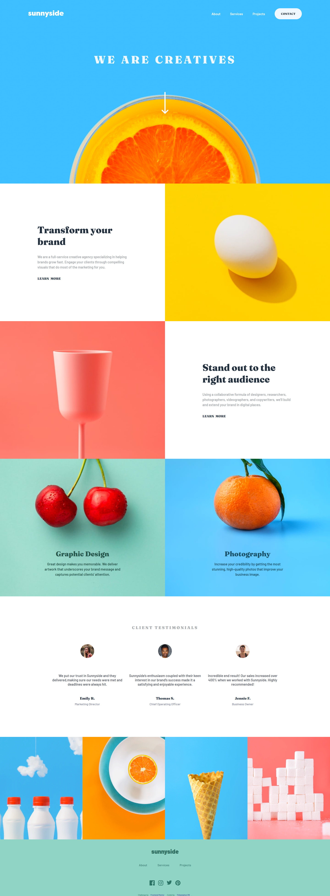

# Frontend Mentor - Sunnyside agency landing page

The technical I use in this project is very basic just HTML CSS and JS only.
I'm finally finished. The first time I saw something like this, the Reference didn't seem HARD, but it was HARD!
In my code, I separate the files for HTML, CSS(Header.css,footer.css,content.css,...), and JS. To keep myself from being confused while working.

## Table of contents

- [Overview](#overview)
- [Links](#links)
- [Built with](#built-with)
- [Author](#author)
- [Acknowledgments](#acknowledgments)
# Overview

# Links
- Solution URL: (https://github.com/thikamphon/sunnyside-landing-page)
- Live Site URL: (https://thikamphon.github.io/sunnyside-landing-page/)

# Built with

- HTML5
- CSS
- JS

# Author

- Frontend Mentor - [@thikamphon.RB](https://www.frontendmentor.io/profile/thikamphon)

# Acknowledgments

- script.js - [@Web Dev Creative]( https://www.youtube.com/watch?v=GdrbE-s5DgQ&t=191s)
